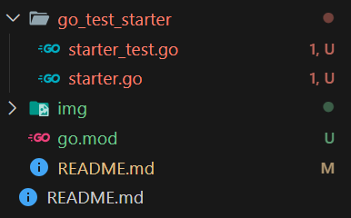
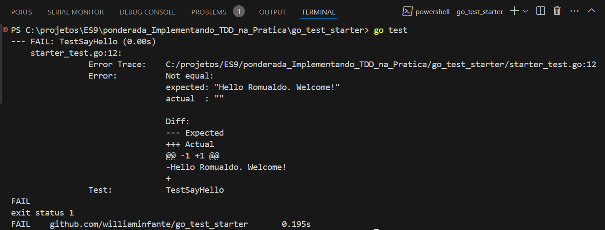

# TTest-Driven Development (TDD) - Documentação e Exemplos

Este repositório foi criado como parte de uma atividade prática para demonstrar e documentar a aplicação da metodologia Test-Driven Development (TDD). O TDD é uma abordagem de desenvolvimento de software que enfatiza a criação de testes automatizados antes da implementação de qualquer funcionalidade. Com essa prática, busca-se aumentar a qualidade do código, garantir ampla cobertura de testes e facilitar a manutenção e evolução do software.

## Estrutura do Repositório

Neste repositório, você encontrará:

1. **Códigos e Exemplos**: Implementações baseadas em um tutorial de TDD, com cada exemplo executado e documentado, incluindo capturas de tela das execuções para melhor compreensão.
   
2. **Documentação Detalhada**: Explicações minuciosas sobre as técnicas e conceitos de TDD utilizados em cada parte do código, com comentários ampliados para fornecer uma visão mais clara dos princípios por trás de cada decisão de design e teste.

## Objetivo

Este projeto tem como principal objetivo consolidar o entendimento da metodologia TDD por meio da prática. Além disso, serve como uma referência documentada que pode ser útil para outros desenvolvedores interessados em aprender ou revisar esses conceitos.

<br>

# Visão geral
Apresentaremos três tipos de funções em nosso pacote inicial. Essas funções foram feitas especificamente para introduzir os conceitos de teste go.

- **SayHello()** — noções básicas;
- **TestPickAnInteger()** — subtestes, refatoração, cobertura;
- **TestCheckHealth()** — uso de bibliotecas de testes mais avançadas.

# Passo a Passo

## 1. Criando as pastas
Execute os comandos abaixo para criar a pasta do projeto e o arquivo de módulo Go:

```
mkdir go_test_starter
go mod init github.com/williaminfante/go_test_starter
```


Imagem 1: Pasta e arquivos necessários criados

## 2. Criação do arquivo principal e de teste

No Go, os arquivos de teste geralmente têm o sufixo _test.go. No exemplo a seguir, criamos starter_test.go no mesmo diretório que starter.go, identificando os testes com o pacote starter_test.



Imagem 2: arquivos principal e de testes criados

## 3. Criação do teste para a função SayHello

Como estamos aplicando TDD, criaremos o teste antes da função SayHello(). No arquivo starter_test.go, adicione o código:

```
package starter_test

import (
  "testing"

  "github.com/stretchr/testify/assert"
  starter "github.com/williaminfante/go_test_starter"
)

func TestSayHello(t *testing.T) {
  greeting := starter.SayHello("Romualdo")
  assert.Equal(t, "Hello Romualdo. Welcome!", greeting)
}
```

## 4. Criação da função SayHello

Agora, implemente a função SayHello em starter.go:

```
package starter

import (
  "fmt"
)

func SayHello(name string) string {
  return fmt.Sprintf("")
}

```

## 5. Verificando o teste

Aplique o comando ``` go test ``` para obter o seguinte resultado:



Imagem 3: Realização dos testes criados até o momento

Como podemos observar, obtemos uma falha em nosso teste pelo mesmo ainda não constar com a função sayhello completa da forma como gostariamos.

Atualize sua função para imprimir o nome que a mesma receber como parametro para verificarmos se a mesma passa pela nossa função ``` TestSayHello ``` como o codigo abaixo:

``` 
package starter

import "fmt"

func SayHello(name string) string {
  return fmt.Sprintf("Hello %v. Welcome!", name)
}
```
Com esse ajuste, execute o comando ``` go test ``` para receber a mensagem informando que o teste está ok, como abaixo:


Imagem 4: Função SayHello testada

## 6. Aprendendo mais sobre cobertura e refatoração

Agora iremos criar a função ```OddOrEven()``` que aceita um inteiro e informa se ele é um inteiro par ou ímpar. Porem, como estamos aplicando a metodologia TDD, iremos criar a função teste para essa função. Portanto, cole o codigo abaixo no arquivo starter.go:

``` 
func TestOddOrEven(t *testing.T) {
  assert.Equal(t, "45 is an odd number", starter.OddOrEven(45))
}
```

Assim como a primeira função que tínhamos, criaremos uma função com a mesma assinatura para starter.goremover o erro de sintaxe e executar o teste:

```
func OddOrEven(num int) string {
  return ""
}
```

Aplique o comando go test para obter o resultado abaixo:


Imagem 5: Realização dos testes criados até o momento

Para satisfazermos o teste criado, adptaremos a função conforme o codigo abaixo:

```
func OddOrEven(num int) string {
  return fmt.Sprintf("%v is an odd number", num)
}
```

Com isso, conseguimos satisfazer os testes ao aplicarmos o comando ``` go test``` e obtermos o seguinte resultado:


Imagem 6: Função com 100% de cobertura

Com o teste ok, devemos começar a refatoração de nossa função, pois podemos obter casos que a mesma receba um numero par, sendo assim, devemos realizar a implementação deste caso em nosso teste conforme codigo abaixo:

```
func TestOddOrEven(t *testing.T) {
  assert.Equal(t, "45 is an odd number", starter.OddOrEven(45))
  assert.Equal(t, "42 is an even number", starter.OddOrEven(42))
}
```

Com essa mudança em nosso teste e ao rodarmos o comando ```go test``` obtemos uma falha em nossos testes como mostra a imagem abaixo pelo fato de nossa função não estar preparada para lidar com numeros pares.


 
 Imagem 7: Realização dos testes criados até o momento

 Para realizarmos a refatoração da nossa função afim de que a mesma passe em nosso teste, adicione o codigo abaixo:

 ```
 func OddOrEven(num int) string {
  criteria := math.Mod(float64(num), 2)
  if criteria == 1 {
    return fmt.Sprintf("%v is an odd number", num)
  }
  return fmt.Sprintf("%v is an even number", num)
}
 ```

 **Observação: Importe o pacote "math" para que tudo possa correr coretamente.**

 Mas e se recebermos um valor zero ou negativo? Será que a nossa função suportará? Veremos ao reftorarmos a nossa função de teste para isso adicionando o codigo abaixo em nosso arquivo starter_test.go.

 ``` 
 func TestOddOrEven(t *testing.T) {
  assert.Equal(t, "45 is an odd number", starter.OddOrEven(45))
  assert.Equal(t, "42 is an even number", starter.OddOrEven(42))
  assert.Equal(t, "0 is an even number", starter.OddOrEven(0))
  assert.Equal(t, "-45 is an odd number", starter.OddOrEven(-45))
}
 ```

Ao executarmos o comando de teste ```go test``` temos como resultado que a nossa função não está apta para isso.


Imagem 8: Realização dos testes criados até o momento

Refatorando nossa função novamente adicionando o codigo abaixo:

``` 
func OddOrEven(num int) string {
  criteria := math.Mod(float64(num), 2)
  if criteria == 1 || criteria == -1 {
    return fmt.Sprintf("%v is an odd number", num)
  }
  return fmt.Sprintf("%v is an even number", num)
}
```

Ao executarmos o comando de teste ```go test``` temos como resultado ok para a nossa função.


Imagem 9: Resultado ok para a nossa função refatorada

Se quisermos facilitar ainda mais a vizualização dos nossos testes, podemos criar subtestes dentro de nossa função de teste conforme o codigo abaixo:

```
func TestOddOrEven(t *testing.T) {
  t.Run("Check Non Negative Numbers", func(t *testing.T) {
    assert.Equal(t, "45 is an odd number", starter.OddOrEven(45))
    assert.Equal(t, "42 is an even number", starter.OddOrEven(42))
    assert.Equal(t, "0 is an even number", starter.OddOrEven(0))
	})
  t.Run("Check Negative Numbers", func(t *testing.T) {
    assert.Equal(t, "-45 is an odd number", starter.OddOrEven(-45))
    assert.Equal(t, "-42 is an even number", starter.OddOrEven(-42))
  })
}
```

## 7. Finalizando com testes avançados

Criando uma verificação de status de uma pagina web via protocolo https. Adicione o codigo abaixo no arquivo starter.go:

``` 
func CheckHealth(writer http.ResponseWriter, req *http.Request) {
  fmt.Fprintf(writer, "health check passed")
}
```
**Obs: Adicione a importação do pacote "net/http"**

Agora construiremos uma função de teste para verificação dessa requisição http atraves da  biblioteca de testes incluída no import "net/http/httptest". Com isso, consiguiremos simular todo o comportamento da requisição http.

Adicione o codigo abaixo no arquivo starter_test.go:

``` 
func TestCheckHealth(t *testing.T) {
  t.Run("Check health status", func(t *testing.T) {
    req := httptest.NewRequest("GET", "http://mysite.com/example", nil)
    writer := httptest.NewRecorder()
    starter.CheckHealth(writer, req)
    response := writer.Result()
    body, _ := io.ReadAll(response.Body)

    assert.Equal(t, "health check passed", string(body))
  })
}
```

Com o módulo de teste httptest, testes relevantes adicionais podem ser adicionados conforme o codigo abaixo:

```
func TestCheckHealth(t *testing.T) {
  t.Run("Check health status", func(t *testing.T) {
    req := httptest.NewRequest("GET", "http://mysite.com/example", nil)
    writer := httptest.NewRecorder()
    starter.CheckHealth(writer, req)
    response := writer.Result()
    body, err := io.ReadAll(response.Body)

    assert.Equal(t, "health check passed", string(body))
    assert.Equal(t, 200, response.StatusCode)
    assert.Equal(t,
                 "text/plain; charset=utf-8",
                 response.Header.Get("Content-Type"))
    assert.Equal(t, nil, err)
  })
}
```

Com todas as nossas funções de testes prontas para validar nossas funções, podemos rodar nossos testes com o comando ``` go test -v``` e verificar o resultado final para cada função teste.


Imagem 10: resultado final para todas funções teste


# Conclusão
Neste projeto, aplicamos o conceito de Test-Driven Development (TDD) para guiar a implementação de funções em Go. O TDD é uma abordagem de desenvolvimento que prioriza a escrita de testes antes da implementação das funcionalidades. A metodologia segue um ciclo iterativo de três etapas principais: Red, Green e Refactor.

Red: Inicialmente, escrevemos um teste que falha, indicando que a funcionalidade desejada ainda não foi implementada ou está incorreta. Esse estágio garante que o teste seja relevante e necessário.

Green: Em seguida, implementamos o código mínimo necessário para passar no teste. O objetivo aqui é fazer o teste "ficar verde", ou seja, passar com sucesso. Nesta fase, o foco está em funcionalidade, não em otimização ou perfeição do código.

Refactor: Com o teste passando, entramos na etapa de refatoração. Aqui, melhoramos o design do código, removemos duplicações e otimizamos a implementação sem alterar seu comportamento. O teste existente garante que as melhorias não quebrem a funcionalidade.

Benefícios do TDD
O uso do TDD traz diversos benefícios, incluindo:

Qualidade de Código: Ao forçar a escrita de testes antes do código, o TDD promove um design de software mais limpo e modular. Funções são escritas para serem testáveis e, portanto, geralmente mais simples e coesas.

Confiança e Segurança: Como os testes são escritos primeiro, eles funcionam como uma rede de segurança, garantindo que alterações futuras no código não introduzam bugs ou quebrem funcionalidades existentes.

Documentação Viva: Os testes servem como uma forma de documentação executável do comportamento do sistema, facilitando o entendimento do código por outros desenvolvedores e ajudando na manutenção a longo prazo.

Facilidade de Refatoração: Com uma suíte de testes robusta, a refatoração se torna menos arriscada, permitindo que o código evolua com mais facilidade sem comprometer a estabilidade.

A prática do TDD, portanto, não só melhora a qualidade e a manutenção do software, mas também acelera o processo de desenvolvimento ao reduzir a necessidade de depuração posterior e a ocorrência de bugs inesperados. Neste projeto, esses princípios foram aplicados para demonstrar como o TDD pode ser integrado de maneira eficaz ao fluxo de desenvolvimento em Go.