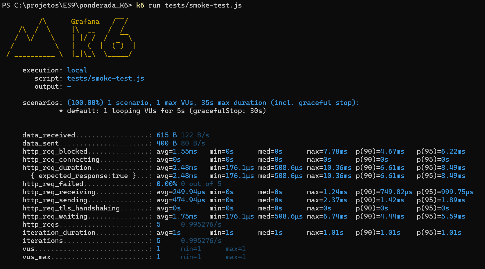

# Tutorial de Teste de Carga com K6

Este tutorial foi elaborado para ensinar como utilizar o K6 para testes de carga em suas aplicações. Vamos abordar desde a instalação até a execução de um teste simples.

### 1. Pré-requisitos
Node.js: Certifique-se de que o Node.js está instalado no seu sistema. Baixe e instale o Node.js.
K6: Vamos instalar o K6, uma ferramenta de teste de carga em código aberto. A instalação está coberta no próximo passo.

### 2. Instalando o K6

Baixe o Chocolatey.
Abra o terminal em modo administrador e execute:
```
choco install k6
```

### 3. Estrutura do Projeto

Crie um diretório para o projeto e entre nele:

```
mkdir ponderada_k6
cd ponderada_k6
```

Adicione o codigo abaixo em um arquivo main.go

```go
package main

import (
    "net/http"

    "github.com/go-chi/chi/v5"
    "github.com/go-chi/chi/v5/middleware"
)

func main() {
    r := chi.NewRouter()
    r.Use(middleware.Logger)
    r.Get("/", func(w http.ResponseWriter, r *http.Request) {
        w.Write([]byte("welcome"))
    })
    http.ListenAndServe(":3000", r)
}
```

Crie uma pasta chamada tests.

# Criando os testes

### 1. Teste de fumaça
Crie um arquivo chamado fumaça-test.js e adicione o codigo abaixo:

```go
import http from 'k6/http';
import { sleep } from 'k6';

export const options = {
  vus: 1,
  duration: '5s',
}

export default function () {
  http.get('http://local:3000');
  sleep(1);
}
```

### 2. Teste de carga
Crie um arquivo chamado fumaça-test.js e adicione o codigo abaixo:

```go
import http from 'k6/http';
import { sleep } from 'k6';

export const options = {
    stages: [
        {
            duration: '10s',
            target: 100
        },
        {
            duration: '30s',
            target: 100
        },
        {
            duration: '10s',
            target: 0
        }
    ]
}

export default function () {
    http.get('http://localhost:3000');
    sleep(1);
}
```

### 3. Teste de estresse
Crie um arquivo chamado stress-test.js e adicione o codigo abaixo:

```go
import http from 'k6/http';
import { sleep } from 'k6';

export const options = {
    stages: [
        {
            duration: '10s',
            target: 200
        },
        {
            duration: '30s',
            target: 200
        },
        {
            duration: '10s',
            target: 0
        }
    ]
}

export default function () {
    http.get('http://localhost:3000');
    sleep(1);
}
```

### 4. Teste de pico
Crie um arquivo chamado pico-test.js e adicione o codigo abaixo:

```go
import http from 'k6/http';
import { sleep } from 'k6';

export const options = {
    stages: [
        {
            duration: '1m',
            target: 10000
        },
        {
            duration: '30s',
            target: 0
        }
    ]
}

export default function () {
    http.get('http://localhost:3000');
    sleep(1);
}
```

### 5. Teste de interrupção
Crie um arquivo chamado interrupcao-test.js e adicione o codigo abaixo:

```go
import http from 'k6/http';
import { sleep } from 'k6';

export const options = {
    stages: [
        {
            duration: '2h',
            target: 100000
        }
    ]
}

export default function () {
    http.get('http://localhost:3000');
    sleep(1);
}
```

### 6. Teste de imersão
Crie um arquivo chamado imersao-test.js e adicione o codigo abaixo:

```go
import http from 'k6/http';
import { sleep } from 'k6';

export const options = {
    stages: [
        {
            duration: '5m',
            target: 1000
        },
        {
            duration: '24h',
            target: 1000
        },
        {
            duration: '5m',
            target: 0
        }
    ]
}

export default function () {
    http.get('http://localhost:3000');
    sleep(1);
}
```

### Executando os testes
Agora para executar cada teste você deve subir a API e executar o comando:

```
k6 run tests/<nome do arquivo teste>.js
```

Assim você verá uma sainda da seguinte forma:



Cabeçalho do K6
Mostra que o teste foi executado localmente e qual script foi utilizado (tests/smoke-test.js).

Também informa que o teste possui 1 cenário com 1 usuário virtual (VU) rodando por um máximo de 35 segundos (incluindo o "graceful stop", que é um período de parada gradual de 30 segundos).
 
### Métricas detalhadas

data_received: 615 B a uma taxa de 122 B/s. Esta é a quantidade total de dados recebidos durante o teste.

data_sent: 400 B a uma taxa de 80 B/s. Quantidade total de dados enviados durante o teste.

http_req_blocked: Tempo médio gasto bloqueando uma requisição (pode incluir o tempo de conexão de DNS e rede). A média é de 1.55 ms, com valores mínimos e máximos de 0 ms a 7.78 ms. As medidas de percentil, como p(90) e p(95), indicam que 90% das requisições foram bloqueadas por até 4.67 ms e 95% delas por até 6.22 ms.

http_req_connecting: Tempo médio gasto estabelecendo a conexão com o servidor. Neste caso, é 0 ms, indicando que não houve tempo significativo gasto conectando (provavelmente um efeito de cache).

http_req_duration: Este é um dos principais indicadores. É o tempo total para receber uma resposta HTTP. A média é de 2.48 ms, com o mínimo de 176.1 µs e o máximo de 10.36 ms. As medidas de percentil indicam que 90% das requisições foram concluídas em até 6.61 ms, e 95% em até 8.49 ms.

http_req_failed: 0.00%. Indica que não houve falhas durante as requisições. Todas as 5 requisições esperadas foram concluídas com sucesso.

http_req_receiving: Tempo médio gasto recebendo dados da resposta. A média é de 249.94 µs, com mínimo de 0 ms e máximo de 1.24 ms.

http_req_sending: Tempo médio gasto enviando a requisição. A média é de 474.94 µs, com mínimo de 0 ms e máximo de 2.37 ms.

http_req_tls_handshaking: Tempo gasto estabelecendo uma conexão TLS. Aqui está a 0 ms, o que indica que o teste não usou uma conexão segura (ou o tempo foi insignificante).

http_req_waiting: Tempo médio em que a requisição ficou aguardando resposta do servidor. A média é de 1.75 ms, indicando a latência do servidor.

http_reqs: Número total de requisições feitas (5 neste caso).

### Estatísticas Gerais
iteration_duration: Duração média de uma iteração do script. Neste caso, é 1.01s.
iterations: Número total de iterações realizadas durante o teste. Aqui foram 5 iterações.
vus e vus_max: Número atual e máximo de usuários virtuais durante o teste. Ambos foram 1, indicando que o teste foi feito com um único usuário simultâneo.