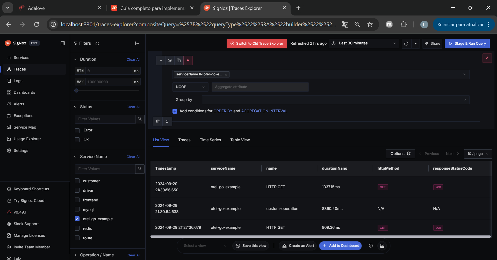

# Tutorial: Instrumentação de Aplicações Go com OpenTelemetry, SigNoz e Práticas de TDD

Neste tutorial, vamos aprender como instrumentar uma aplicação Go utilizando o OpenTelemetry e visualizar os dados de telemetria no SigNoz. Além disso, aplicaremos as técnicas e conceitos de Test-Driven Development (TDD) ao longo do desenvolvimento, enriquecendo o código com comentários explicativos.

# Introdução
A observabilidade é essencial para entender o comportamento de aplicações distribuídas modernas. O OpenTelemetry é um conjunto de ferramentas, APIs e SDKs que permite a coleta de métricas, logs e traces de aplicações. O SigNoz é uma plataforma de observabilidade open-source que permite visualizar esses dados.

## Pré-requisitos
Go instalado (versão 1.16 ou superior).
Docker Desktop instalado e em execução.
Git instalado.

# Instalação do SigNoz
### Clonar o Repositório do SigNoz

Abra o terminal ou PowerShell e clone o repositório do SigNoz:

```
git clone https://github.com/SigNoz/signoz.git
```

# Configurar o docker-compose.yaml
### Navegue até o diretório do Docker Compose:

```
cd signoz/deploy/docker/clickhouse-setup
```

# Iniciar o SigNoz com o Docker Compose
Inicie os serviços:

```
docker-compose up -d
```

Você deve ver contêineres como signoz-frontend, signoz-query-service, signoz-otel-collector, etc.

Acesse o SigNoz no navegador:
http://localhost:3301

# Desenvolvimento da Aplicação Go com TDD
Aplicaremos o ciclo do TDD: Red -> Green -> Refactor.

### Inicializar o Módulo Go
Crie um diretório para o projeto e inicialize o módulo Go:

```
mkdir PONDERADA_OPENTELEMETRY
cd ONDERADA_OPENTELEMETRY
go mod init PONDERADA_OPENTELEMETRY
```

### Escrever o Primeiro Teste (Red)
Criamos um arquivo de `teste main_test.go` para escrever nosso primeiro teste.

```go
package main

import (
    "testing"
)

// TestHelloWorld verifica se a função helloWorld retorna a string esperada.
func TestHelloWorld(t *testing.T) {
    expected := "Hello, OpenTelemetry!"
    result := helloWorld()
    if result != expected {
        t.Errorf("Resultado esperado '%s', mas obteve '%s'", expected, result)
    }
}
```

### Implementar o Código para Passar no Teste (Green)
Implementamos a função helloWorld em main.go para passar no teste.

```go
package main

// helloWorld retorna uma saudação.
func helloWorld() string {
    return "Hello, OpenTelemetry!"
}

func main() {
    // Aqui podemos chamar a função helloWorld se necessário.
}
```

### Refatorar o Código (Refactor)
Refatoramos o código se necessário. Neste caso, o código é simples e serve apenas de exemplo de como poderiamos realizar para as demais funções, mas em aplicações reais, poderíamos melhorar a estrutura ou otimizar funções.

# Instrumentação com OpenTelemetry
### Adicionar Dependências do OpenTelemetry
Adicione as dependências necessárias:

```
go get go.opentelemetry.io/otel@latest
go get go.opentelemetry.io/otel/sdk@latest
go get go.opentelemetry.io/otel/exporters/otlp/otlptrace/otlptracehttp@latest
go get go.opentelemetry.io/contrib/instrumentation/net/http/otelhttp@latest
```

# Configurar Variáveis de Ambiente
Defina as variáveis de ambiente para apontar para o SigNoz:

```
$env:OTEL_EXPORTER_OTLP_ENDPOINT = "http://localhost:4318"
$env:OTEL_RESOURCE_ATTRIBUTES = "service.name=otel-go-tdd-example"
```

# Executar a Aplicação e Verificar os Traces no SigNoz
Execute a aplicação:

```
go run main.go
```

Você deve ver:

```
Fazendo requisição HTTP...
Requisição concluída.
```

# Verificar os Traces no SigNoz
1. Acesse http://localhost:3301 no navegador.
2. Navegue até a seção Traces.
3. Procure pelo serviço otel-go-tdd-example.
4. Visualize os traces e spans coletados.



