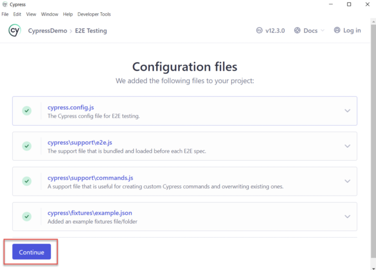

# Ponderada Teste de aplicação React com Cypress

## Passo a Passo para Testar React com Cypress

### Preparação do Ambiente
Instale Node.js e um editor de texto como VSCode.

### 1. Criar o package.json
Use o comando `npm init` para criar o arquivo `package.json`
Você precisará responder algumas perguntar para estruturar seu ambiente conforme imagem abaixo:


Ao confirmar, ele criará o arquivo package.json com as informações que você configurou conforme imagem abaixo:


### 2. Instalar Cypress
Execute `npm install cypress --save-dev`

### Abrir Cypress
Use `npx cypress open` para configurar o Cypress.

### Configuração Inicial
Selecione o tipo de teste (End to End ou Component).


Em seguida você verá as configurações padrões do Cypress. Clique em Continue para avançar.



### Escolha um navegador
Você pode escolher entre os navegadores disponíveis, o Cypress reúne informações de todos os navegadores instalados no seu Sistema. Se ele suportar o tipo de navegador e a versão do navegador, ele lista na seção Escolha um navegador.


### Criar e Executar os Testes

Crie um novo arquivo de especificação.


De um nome para sua nova especificação de teste


Após isso, clique em okay para rodar o teste de exemplo.


## Alterando o codigo de exemplo para um codigo teste novo

Abra o codigo de exemplo e substitua pelo codigo abaixo:

``` js
//react-demo.cy.js
describe('React todo example', () => {
it('Should add and verify todo list', () => {
cy.visit('https://reactjs.org/');
cy.get('#new-todo').type("My first todo item");
cy.get('#new-todo').siblings('button').click();
cy.get('#new-todo').type("My second todo item");
cy.get('#new-todo').siblings('button').click();
cy.get('div[id = "todos-example"] >div >ul > li').eq(0).should('have.text', 'My first todo item')
cy.get('div[id = "todos-example"] >div >ul > li').eq(1).should('have.text', 'My second todo item')
})
})      

```

Em seguida, execute o comando seguindo a syntax `npx cypress run --browser <browser_name> --spec <spec_file>`

Caso você tenha seguido todos os nossos passos, pode executar `npx cypress run --browser chrome --spec './cypress/e2e/spec.cy.js'`

Após executar esse comando você verá as seguintes informações:


Para mais detalhes sobre como realizamos esse tutorial, entre no link https://www.browserstack.com/guide/how-to-test-react-using-cypress

**Obs:** O segundo teste da calcularoda não foi realizado pois o link está quebrado.