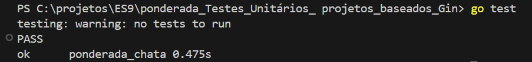
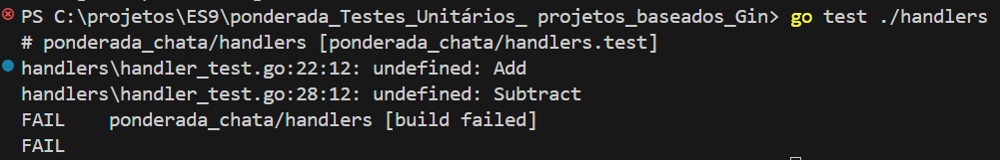
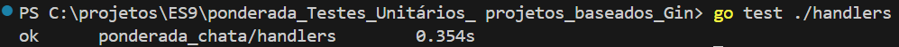

# Configuração inicial com a função testMain:

## Configurando a Função `TestMain`

A função `TestMain` permite executar tarefas de configuração e desmontagem para seus testes e deve ser definida apenas uma vez em todo o pacote. Aqui está um exemplo básico:

```
package main

import (
	"os"
	"testing"
)

func TestMain(m *testing.M) {

    code := m.Run()

    os.Exit(code)
}
```

Quando configuramos a função TestMain, ela já reconhece um script de teste definido para futuros testes, como mostrado na imagem abaixo:



## Estruturando Testes com Suítes

Em seguida, criamos o arquivo `mypackage_test.go` para estruturar o conceito de Test Suites, que permite agrupar testes em unidades lógicas. Aqui está um exemplo básico:

``` 
package mypackage

import (
    "testing"
    "github.com/stretchr/testify/suite"
)

// MySuite is a test suite containing multiple related tests.
type MySuite struct {
    suite.Suite
}

func (suite *MySuite) SetupTest() {
    // Setup code before each test
}

func (suite *MySuite) TestSomething() {
    // Test code
}

func TestSuite(t *testing.T) {
    // Run the test suite
    suite.Run(t, new(MySuite))
}
```
## Estrutura do Projeto e Local dos Testes
A estrutura típica de um projeto em Go pode ser organizada da seguinte forma:

```
/myproject
|-- /handlers
|   |-- handler.go
|   |-- handler_test.go
|
|-- /db
|   |-- database.go
|   |-- database_test.go
|
|-- main.go
|-- go.mod
|-- go.sum
```

**handlers:** contém os manipuladores de solicitações HTTP para o aplicativo.

**db:** gerencia as conexões e consultas do banco de dados.

**main.go:** Este é o ponto de entrada principal para o aplicativo.

**go.mod e go.sum:** Esses arquivos gerenciam as dependências.

## Implementando Testes Simples com TDD
Vamos aplicar o conhecimento adquirido para criar e testar funções simples.

### Passo 1: Crie os Testes
No arquivo `handler_test.go` dentro da pasta handlers, adicione o seguinte código:

```
package handler

import (
	"testing"

	"github.com/stretchr/testify/assert"
	"github.com/stretchr/testify/suite"
)

type MySuite struct {
	suite.Suite
}

func (suite *MySuite) SetupTest() {
}

func (suite *MySuite) TestAddition() {
	result := Add(1, 1)
	assert.Equal(suite.T(), 2, result, "1 + 1 deve ser igual a 2")
}

func (suite *MySuite) TestSubtraction() {
	result := Subtract(2, 1) // Chama a função Subtract
	assert.Equal(suite.T(), 1, result, "2 - 1 deve ser igual a 1")
}

func TestSuite(t *testing.T) {
	suite.Run(t, new(MySuite))
}

```

Agora, execute o comando `go test ./handlers.` Como ainda não configuramos as funções `Add` e `Subtract`, os testes falharão, conforme a metodologia TDD.



### Passo 2: Implemente as Funções
No arquivo `handler.go`, adicione o seguinte código para implementar as funções:

```
func Add(a, b int) int {
    return a + b
}

func Subtract(a, b int) int {
    return a - b
}
```

### Passo 3: Execute os Testes Novamente
Por fim, execute novamente o comando `go test ./handlers` para verificar se todos os testes passaram:

