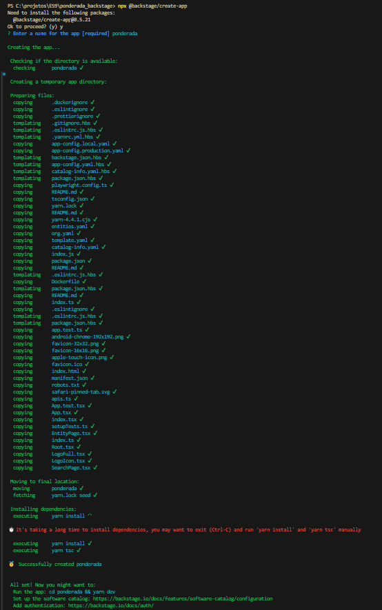
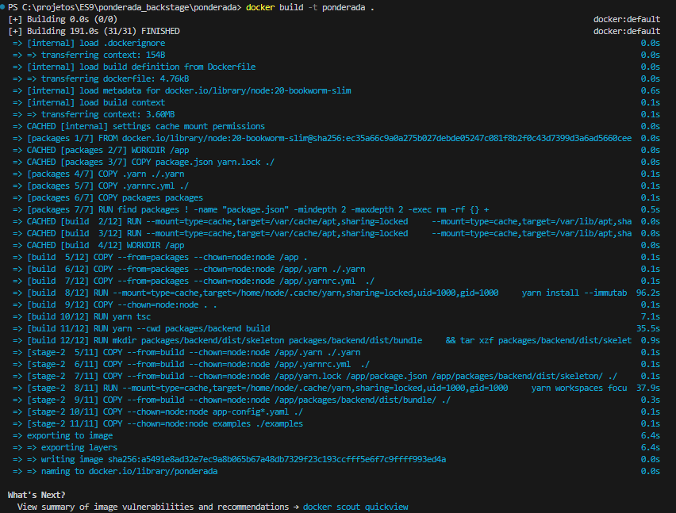
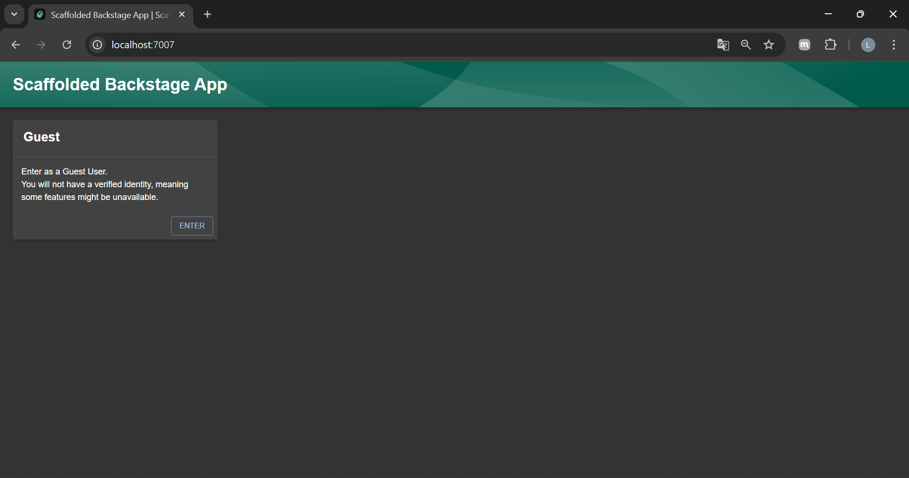
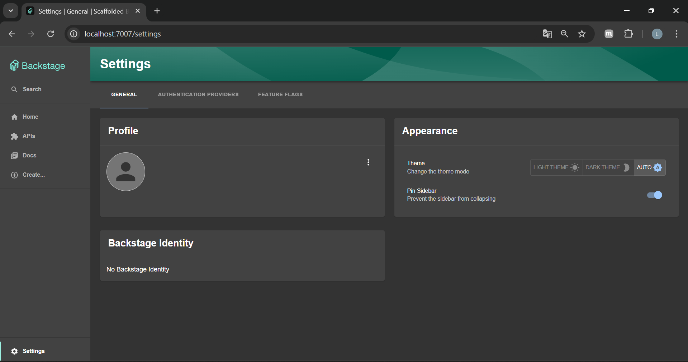

# Tutorial: Criação e Execução do Backstage com Docker e SQLite

Este guia explica como criar um app **Backstage** usando **SQLite** como banco de dados e empacotá-lo em um contêiner **Docker**. Também abordamos as correções necessárias para evitar problemas comuns relacionados ao PostgreSQL.

---

## 1. Criar um Novo App Backstage

Para criar um novo projeto Backstage, siga estes passos:

1. Abra um terminal e execute o seguinte comando:
```
   npx @backstage/create-app
```
Após executar esse comando ele irá solicitar para que você concorde (y e enter) e de um nome ao projeto (no caso aqui, ponderada) para prosseguir conforme imagem abaixo:



2. Navegue até a pasta do projeto utilizando o comando:
```
cd ponderada
```

Para afim de saber se todas os arquivos e configurações foram instalados corretamente, testaremos o App localmente:

**Instale as dependências:**
```
yarn install
```

**Execute o app com o comando abaixo:**
```
yarn dev
```

**Acesse o app no browser utilizando o seguinte caminho:**
```
http://localhost:3000
```


## 2. Editando configurações
Agora para que tudo de certo na configuração do nosso Docker, precisamos realizar algumas alterações.

Nos arquivos app-config.yaml e app-config.production.yaml substitua a configuração do database para um sqlite.

```yaml
backend:
  database:
    client: sqlite3
    connection:
      filename: ':memory:'
```

## 3. Alterando tsconfig.json
Altere seu arquivo `tsconfig.json` para como o codigo abaixo pois não estamos fazendo uso de plugins.

```json
{
  "extends": "@backstage/cli/config/tsconfig.json",
  "include": [
    "packages/*/src",
    "packages/*/config.d.ts"
  ],
  "exclude": ["node_modules"],
  "compilerOptions": {
    "outDir": "dist-types",
    "rootDir": "."
  }
}
```

## 3. Criar o arquivo Dockerfile dentro do seu projeto

Crie um arquivo `Dockerfile` com o seguinte conteúdo:

```
# Stage 1 - Create yarn install skeleton layer
FROM node:20-bookworm-slim AS packages

WORKDIR /app
COPY package.json yarn.lock ./
COPY .yarn ./.yarn
COPY .yarnrc.yml ./

COPY packages packages

# Comment this out if you don't have any internal plugins
# COPY plugins plugins

RUN find packages \! -name "package.json" -mindepth 2 -maxdepth 2 -exec rm -rf {} \+

# Stage 2 - Install dependencies and build packages
FROM node:20-bookworm-slim AS build

# Set Python interpreter for `node-gyp` to use
ENV PYTHON=/usr/bin/python3

# Install isolate-vm dependencies, these are needed by the @backstage/plugin-scaffolder-backend.
RUN --mount=type=cache,target=/var/cache/apt,sharing=locked \
    --mount=type=cache,target=/var/lib/apt,sharing=locked \
    apt-get update && \
    apt-get install -y --no-install-recommends python3 g++ build-essential && \
    rm -rf /var/lib/apt/lists/*

# Install sqlite3 dependencies. You can skip this if you don't use sqlite3 in the image,
# in which case you should also move better-sqlite3 to "devDependencies" in package.json.
RUN --mount=type=cache,target=/var/cache/apt,sharing=locked \
    --mount=type=cache,target=/var/lib/apt,sharing=locked \
    apt-get update && \
    apt-get install -y --no-install-recommends libsqlite3-dev && \
    rm -rf /var/lib/apt/lists/*

USER node
WORKDIR /app

COPY --from=packages --chown=node:node /app .
COPY --from=packages --chown=node:node /app/.yarn ./.yarn
COPY --from=packages --chown=node:node /app/.yarnrc.yml  ./

RUN --mount=type=cache,target=/home/node/.cache/yarn,sharing=locked,uid=1000,gid=1000 \
    yarn install --immutable

COPY --chown=node:node . .

RUN yarn tsc
RUN yarn --cwd packages/backend build

RUN mkdir packages/backend/dist/skeleton packages/backend/dist/bundle \
    && tar xzf packages/backend/dist/skeleton.tar.gz -C packages/backend/dist/skeleton \
    && tar xzf packages/backend/dist/bundle.tar.gz -C packages/backend/dist/bundle

# Stage 3 - Build the actual backend image and install production dependencies
FROM node:20-bookworm-slim

# Set Python interpreter for `node-gyp` to use
ENV PYTHON=/usr/bin/python3

# Install isolate-vm dependencies, these are needed by the @backstage/plugin-scaffolder-backend.
RUN --mount=type=cache,target=/var/cache/apt,sharing=locked \
    --mount=type=cache,target=/var/lib/apt,sharing=locked \
    apt-get update && \
    apt-get install -y --no-install-recommends python3 g++ build-essential && \
    rm -rf /var/lib/apt/lists/*

# Install sqlite3 dependencies. You can skip this if you don't use sqlite3 in the image,
# in which case you should also move better-sqlite3 to "devDependencies" in package.json.
RUN --mount=type=cache,target=/var/cache/apt,sharing=locked \
    --mount=type=cache,target=/var/lib/apt,sharing=locked \
    apt-get update && \
    apt-get install -y --no-install-recommends libsqlite3-dev && \
    rm -rf /var/lib/apt/lists/*

# From here on we use the least-privileged `node` user to run the backend.
USER node

# This should create the app dir as `node`.
# If it is instead created as `root` then the `tar` command below will
# fail: `can't create directory 'packages/': Permission denied`.
# If this occurs, then ensure BuildKit is enabled (`DOCKER_BUILDKIT=1`)
# so the app dir is correctly created as `node`.
WORKDIR /app

# Copy the install dependencies from the build stage and context
COPY --from=build --chown=node:node /app/.yarn ./.yarn
COPY --from=build --chown=node:node /app/.yarnrc.yml  ./
COPY --from=build --chown=node:node /app/yarn.lock /app/package.json /app/packages/backend/dist/skeleton/ ./
# Note: The skeleton bundle only includes package.json files -- if your app has
# plugins that define a `bin` export, the bin files need to be copied as well to
# be linked in node_modules/.bin during yarn install.

RUN --mount=type=cache,target=/home/node/.cache/yarn,sharing=locked,uid=1000,gid=1000 \
    yarn workspaces focus --all --production && rm -rf "$(yarn cache clean)"

# Copy the built packages from the build stage
COPY --from=build --chown=node:node /app/packages/backend/dist/bundle/ ./

# Copy any other files that we need at runtime
COPY --chown=node:node app-config*.yaml ./

# This will include the examples, if you don't need these simply remove this line
COPY --chown=node:node examples ./examples

# This switches many Node.js dependencies to production mode.
ENV NODE_ENV=production

# This disables node snapshot for Node 20 to work with the Scaffolder
ENV NODE_OPTIONS="--no-node-snapshot"

CMD ["node", "packages/backend", "--config", "app-config.yaml", "--config", "app-config.production.yaml"]
```

## 4. Arquivo .dockerignore

Agora assim como o tutorial sugere, adicionarmos o seguinte conteudo em nosso arquivo `.dockerignore`:
```
dist-types
node_modules
packages/*/dist
packages/*/node_modules
plugins/*/dist
plugins/*/node_modules
*.local.yaml
```

## 5. Construindo uma imagem Docker
Crie a imagem Docker utilizando o comando abaixo:

```
docker build -t ponderada .
```

Assim você verá algo assim em seu terminal:



## 6. Executar o Contêiner Docker

Agora para executar o contêiner basta executar o comando abaixo:

```
docker run -it -p 7007:7007 ponderada
```

Assim você verá alguns logs em seu terminal como mostra a imagem abaixo:


## 7. Acessadno a aplicação

Agora basta você digitar `http://localhost:7007` na barra de pesquisa do seu navegador que você conseguira acessar a aplicação.



